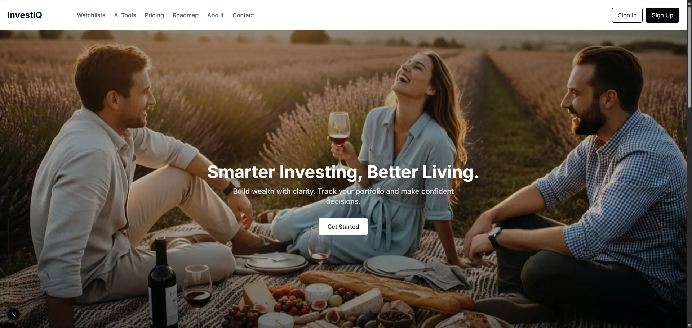
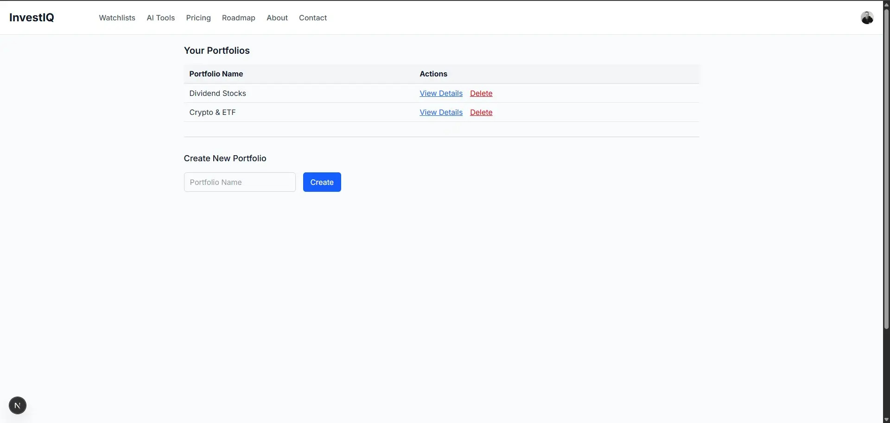
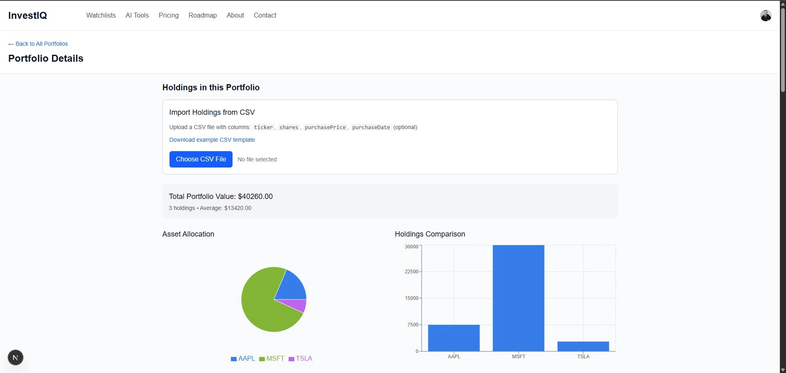
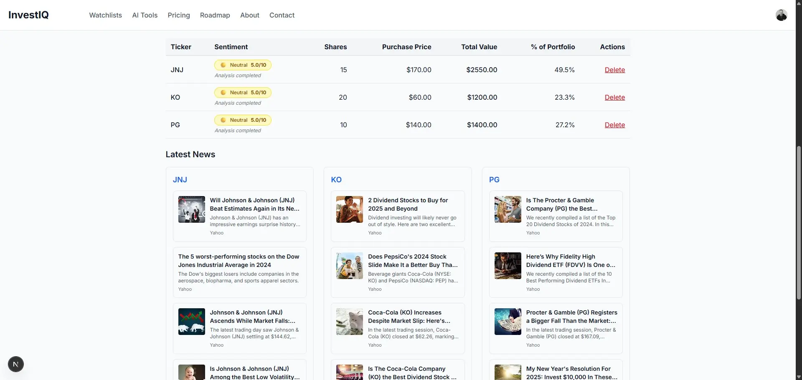
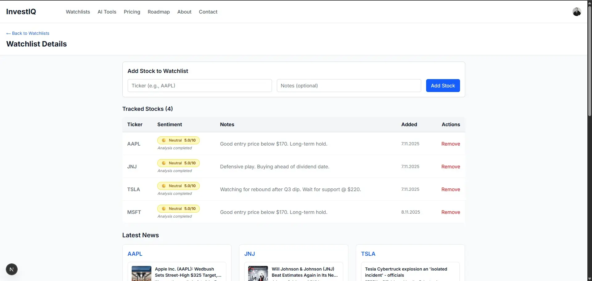
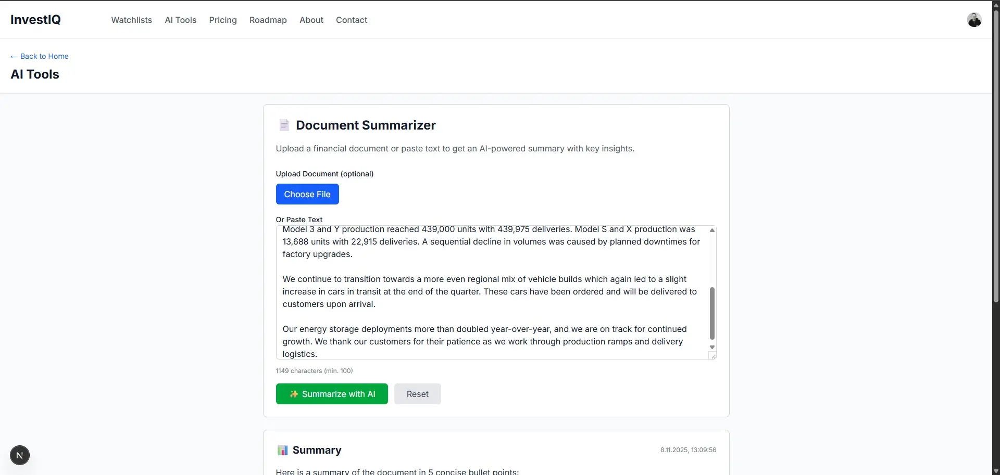
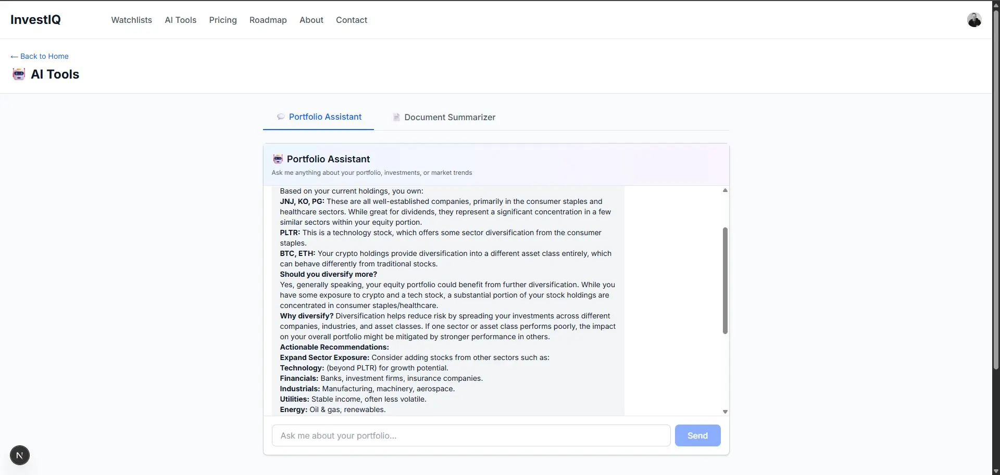
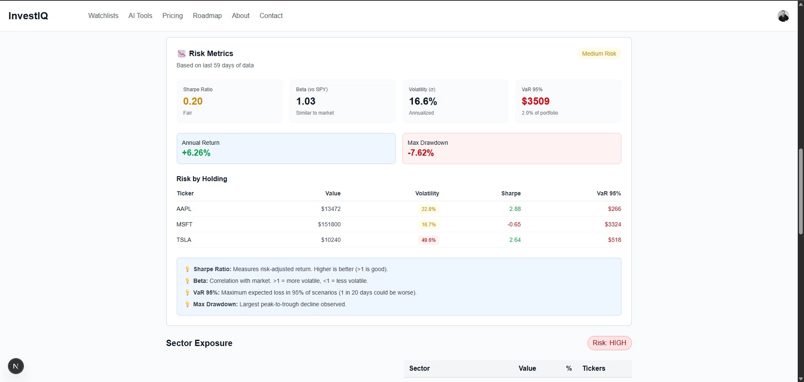
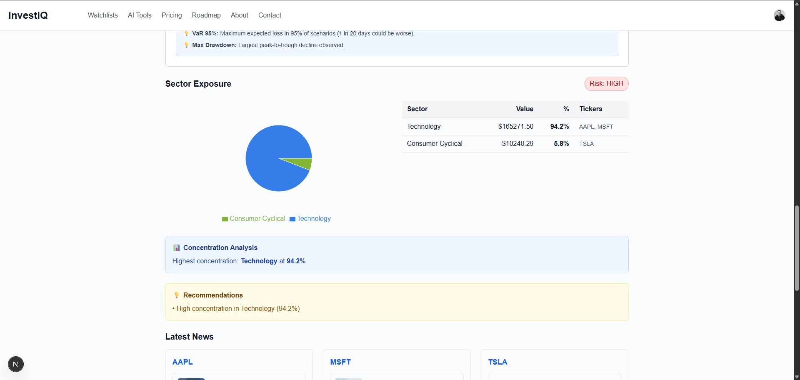

# InvestIQ – The AI-Powered Portfolio Intelligence Platform

[](./#project-roadmap)
[](./#tech-highlights)
[](./#tech-highlights)
[](./#tech-highlights)
[](./#tech-highlights)
[](./#tech-highlights)
[](./#tech-highlights)
[](./#tech-highlights)
[](./#tech-highlights)

**InvestIQ** is a next-generation platform designed to bring clarity and intelligence to portfolio management. It combines financial analytics, AI-driven insights, and seamless automation to help **individual investors and professional asset managers** make better decisions.

---

## 🌟 Key Features

### 📊 Portfolio Intelligence

- **Real-time tracking** of multiple portfolios with unlimited holdings per plan
- **Advanced analytics** including correlation matrices, risk metrics, and sector exposure
- **Performance insights**: Sharpe Ratio, Beta, Value at Risk (VaR 95%), Max Drawdown
- **Diversification Score**: AI-powered analysis of portfolio concentration risk
- **Interactive visualizations**: Using recharts for trends, allocation pie charts, and comparisons
- **Historical data**: 30 days (Free), 5 years (Pro), unlimited (Enterprise)
- **Transaction tracking**: Manual CSV import with automatic cost basis calculation
- **Multi-currency support**: Track international holdings with live exchange rates

### 🤖 AI-Powered Insights

- **Document Summarization**: Extract key insights from earnings reports, 10-Ks, and financial documents
- **Market Sentiment Analysis**: AI-driven sentiment scoring from aggregated news sources (News API)
- **Interactive Assistant**: Natural language queries powered by Google Gemini API
- **Smart Recommendations**: AI suggestions for diversification based on correlation analysis
- **Risk Alerts**: Automated notifications for over-concentration in sectors
- **Contextual Answers**: Portfolio-specific responses using historical data and current holdings
- **Usage Limits**: 10 requests/month (Free), 500/month (Pro), unlimited (Enterprise)

### 👥 Team Collaboration & RBAC

- **Multi-tenant Organizations**: Create unlimited workspaces for teams
- **4-Tier Role System**: Owner, Admin, Member, Viewer with granular permissions
- **Shared Portfolios & Watchlists**: Collaborate on investment strategies across teams
- **Smart Invitation System**: Email-based invites with 7-day expiry tokens
- **Auto-accept on Sign Up**: New users automatically join organizations they were invited to
- **Member Management**: Add, remove, and change roles with permission enforcement
- **Self-protection**: Members cannot remove themselves or delete the organization owner
- **Audit Logging**: Comprehensive tracking of all sensitive actions (invites, removals, billing changes)

### 💳 Flexible Subscription Plans

- **3-Tier Pricing**: Free (hobbyists), Pro ($19.99/mo for investors), Enterprise ($99.99/mo for teams)
- **Stripe Integration**: Secure checkout with customer portal for self-service billing
- **Real-time Webhooks**: Automatic plan activation, renewals, and cancellations
- **Usage Enforcement**: Middleware-based limits per resource (portfolios, AI requests, PDF reports)
- **Usage Dashboard**: Live tracking of current consumption vs. plan limits
- **Flexible Cancellation**: Cancel anytime with access until period end
- **Plan Comparison**: Interactive pricing page with feature matrix

### 📈 Advanced Reporting & Automation

- **4 Report Types**: Performance, Risk Analysis, Sector Breakdown, Full Comprehensive
- **Professional PDFs**: Generated with pdfmake library, ready for client presentations
- **Manual Downloads**: On-demand report generation with loading indicators
- **Scheduled Delivery**: Automated daily/weekly/monthly reports via email (Resend integration)
- **Cron Automation**: Hourly job processing scheduled reports
- **Email Attachments**: PDF reports delivered directly to inbox
- **Report Management**: View, edit, and delete scheduled reports
- **Plan-based Limits**: Free (0 reports), Pro (50/month), Enterprise (unlimited)

---

## 🏗️ Architecture Overview

InvestIQ is built on a modern, serverless architecture designed for scalability and performance:

```
┌─────────────────────────────────────────────────────────────┐
│                    USER (Browser/Mobile)                     │
├─────────────────────────────────────────────────────────────┤
│  Clerk Auth   │  Next.js Frontend  │  TanStack Query        │
└────────┬──────────────┬─────────────────────┬───────────────┘
         │              │                     │
         ▼              ▼                     ▼
┌─────────────────────────────────────────────────────────────┐
│          CLOUDFLARE WORKERS (Hono Backend API)               │
├─────────────────────────────────────────────────────────────┤
│  • Organization Middleware    • Billing Integration          │
│  • RBAC Enforcement          • Rate Limiting (Upstash)      │
│  • Usage Limits              • PDF Generation               │
│  • Audit Logging             • Input Validation (Zod)       │
└────┬─────────┬──────────┬──────────┬──────────┬────────────┘
     │         │          │          │          │
     ▼         ▼          ▼          ▼          ▼
┌──────────┐ ┌─────────┐ ┌────────┐ ┌──────────┐ ┌─────────┐
│ D1 (SQL) │ │ KV Cache│ │ Stripe │ │  Gemini  │ │ Upstash │
│ Database │ │ Storage │ │   API  │ │ AI API   │ │  Redis  │
│          │ │         │ │        │ │          │ │ (Rate   │
│ SQLite   │ │ Sessions│ │ Billing│ │ Chat/AI  │ │ Limit)  │
└──────────┘ └─────────┘ └────────┘ └──────────┘ └─────────┘
```

### Key Architectural Decisions

- **Serverless-First**: Edge computing via Cloudflare Workers for global low latency
- **Type-Safe**: End-to-end TypeScript across frontend, backend, and shared packages
- **Multi-Tenant**: Organization-based data isolation with role-based access control
- **AI Integration**: Google Gemini API for document analysis and conversational insights
- **Real-time Data**: Integration with Polygon.io for live market data and historical prices

---

## 🧠 Tech Highlights

| Layer          | Technology                               |
| -------------- | ---------------------------------------- |
| **Frontend**   | Next.js 16 + TypeScript + Tailwind CSS   |
| **Backend**    | Cloudflare Workers (Hono Framework)      |
| **Database**   | Cloudflare D1 (SQLite) + KV Storage      |
| **AI/ML**      | Google Gemini API                        |
| **Auth**       | Clerk (User Management & SSO)            |
| **Payments**   | Stripe (Subscriptions & Billing)         |
| **Rate Limit** | Upstash Redis                            |
| **Monitoring** | Sentry (Error Tracking)                  |
| **Deployment** | Vercel (Frontend) + Cloudflare (Backend) |
| **CI/CD**      | GitHub Actions                           |

---

## 🗺️ Project Roadmap

### **Phase 1: MVP - "Personal Portfolio Monitor"** ✅

_Goal: User can manually input their portfolio and view its current value._

- Step 0: Tech Foundations ✅
- Step 1: Authentication (Clerk Integration) ✅
- Step 2: Backend - Portfolio API Endpoints ✅
- Step 3: Database - Cloudflare D1 Schema & Connection ✅
- Step 4: Secure Backend (Clerk Middleware for Auth) ✅
- Step 5: Frontend - Portfolio UI (TanStack Query Integration) ✅

### **Phase 2: Core Functionality Expansion** ✅

_Focus: Adding key visualization, data, and user management features._

- Step 6: Data Visualizations and Charts ✅
- Step 7: Financial News Aggregation ✅
- Step 8: Transaction Import (from File) ✅
- Step 9: Watchlists Implementation ✅

### **Phase 3: AI-Powered Insights** ✅

_Focus: Leveraging AI to deliver intelligent, unique value._

- Step 10: Document Summarization (AI) ✅
- Step 11: Market Sentiment Analysis (AI) ✅
- Step 12: Interactive Portfolio Assistant (AI) ✅

### **Phase 3.5: Smart Portfolio Analytics** ✅

_Focus: Deeper financial analysis and risk/performance metrics._

- Step 13: Asset Correlation Analysis ✅
  - Correlation matrix between tickers
  - Heat map visualization
  - Detection of strong relationships
- Step 14: Portfolio Risk Metrics ✅
  - Sharpe Ratio (return/risk)
  - Beta (volatility vs market)
  - Value at Risk (VaR 95%)
  - Diversification Score
- Step 15: Sector Exposure Analysis ✅
  - Grouping by sectors
  - Allocation % chart
  - Alerts for over-concentration
  - Diversification recommendations

### **Phase 4: Maturity and Monetization** ✅

_Focus: Preparing the platform for commercial use and ensuring stability._
_Status: Completed!_ ✅

- Step 17: Multi-Tenant Organizations & Team Management ✅
  - Create unlimited organizations (workspaces)
  - Default organization created automatically for each user
  - Invite team members via email with role selection (Viewer/Member/Admin)
  - Time-limited invitation tokens (7-day expiry)
  - Auto-accept invites on sign-up/sign-in flow
  - Member list with role badges and management UI
  - Remove members with RBAC enforcement (can't remove self or owner)
  - Share portfolios and watchlists across organization
  - Secure invitation system with token validation
  - Dark backdrop behind Clerk authentication modal
- Step 18: Payment Integration & Subscription Management ✅
  - Stripe Test Mode integration with 3 product tiers
  - Checkout flow: Create session → Redirect → Payment → Webhook
  - Webhook event handling (checkout.session.completed, customer.subscription.\*)
  - Subscription status tracking (active/cancelled/past_due)
  - Customer portal for self-service billing management
  - Plan badge display (FREE/PRO/ENTERPRISE)
  - Success page with auto-redirect after payment
  - Usage limit enforcement per plan tier
  - Automatic plan upgrade/downgrade handling
- Step 19: Advanced Reporting & Automation ✅
  - PDF generation with pdfmake library
  - 4 report types: Performance, Risk Analysis, Sector Breakdown, Full
  - Manual download with loading indicators
  - Scheduled reports system with database table
  - Cron job (hourly) for processing scheduled deliveries
  - Email integration via Resend for report attachments
  - Report management UI: create, view, delete schedules
  - Plan-based limits: Free (0), Pro (50/month), Enterprise (unlimited)
- Step 20: Production Hardening & Security ✅
  - Rate limiting with Upstash Redis ✅
    - `/api/organizations`: 10 requests/minute
    - `/api/billing/*`: 5 requests/minute
    - `/api/reports/*`: 5 requests/minute
  - Input validation with Zod schemas on all endpoints ✅
  - Comprehensive audit logging for sensitive actions ✅
  - Audit log viewer for Admin/Owner roles ✅
  - Middleware-based RBAC enforcement ✅
  - Error monitoring with Sentry ✅
  - Production deployment ✅
  - GDPR compliance features ✅

### **🚀 Phase 5: Advanced ML** (Current Phase)

_Focus: State-of-the-art machine learning models for market prediction and optimization._

- ⏳ LSTM Price Predictions
  - Time series forecasting for individual stocks
  - Multi-step ahead predictions (1-day, 1-week, 1-month)
  - Confidence intervals and prediction accuracy metrics
  - Integration with historical price data
- ⏳ Anomaly Detection
  - Detect unusual portfolio behavior and market movements
  - Real-time alerts for significant deviations
  - Pattern recognition for fraud detection
  - Historical anomaly analysis
- ⏳ Portfolio Optimization (Modern Portfolio Theory)
  - Efficient frontier calculation
  - Risk-return optimization
  - Multi-objective optimization (return, risk, ESG)
  - Rebalancing recommendations
- ⏳ Advanced Graph Neural Networks
  - Sheaf-GNN for market relationship modeling
  - Stock correlation networks
  - Sector influence propagation
  - Community detection in market structure
- ⏳ Technical Indicators Dashboard
  - Moving Averages (SMA, EMA, WMA)
  - RSI (Relative Strength Index)
  - MACD (Moving Average Convergence Divergence)
  - Bollinger Bands
  - Support/Resistance levels
  - Fibonacci retracements
  - Volume indicators (OBV, VWAP)
  - Trend strength indicators (ADX)

#### **Legend**

- **✅ Completed**
- **⏳ In Progress**
- **⬜ Planned**

---

## 💼 Subscription Plans

### Free Plan

- 2 portfolios
- 20 holdings per portfolio
- 2 watchlists
- 10 AI requests/month
- 30 days historical data
- Basic analytics

### Pro Plan - $19.99/month

- 10 portfolios
- 200 holdings per portfolio
- 10 watchlists
- 500 AI requests/month
- 5 years historical data
- **Advanced analytics & risk metrics**
- **5 team members**
- **50 PDF reports/month**
- CSV export

### Enterprise Plan - $99.99/month

- Unlimited portfolios & holdings
- Unlimited watchlists
- Unlimited AI requests
- Full historical data
- **Advanced analytics & risk metrics**
- **50 team members**
- **Unlimited PDF reports**
- **API access**
- **White-label options**
- **Priority support**

---

## 🔒 Security & Compliance

InvestIQ takes security seriously with multiple layers of protection:

- **Authentication**: Clerk-based SSO with MFA support
- **Authorization**: Role-Based Access Control (RBAC) for all resources
- **Rate Limiting**: API abuse prevention via Upstash Redis
- **Input Validation**: Zod schemas for all user inputs
- **Audit Logging**: Comprehensive tracking of sensitive actions
- **Data Encryption**: All data encrypted at rest and in transit
- **Webhook Verification**: Cryptographic signature validation for payment events
- **Error Monitoring**: Real-time alerts via Sentry

### RBAC Permission Matrix

InvestIQ implements a 4-tier role system with granular permissions:

| Category         | Action                               | 👁️ Viewer | 👤 Member | 🛡️ Admin | 👑 Owner |
| :--------------- | :----------------------------------- | :-------: | :-------: | :------: | :------: |
| **PORTFOLIOS**   | View shared portfolios               |    ✅     |    ✅     |    ✅    |    ✅    |
|                  | Create new portfolio in organization |    ❌     |    ✅     |    ✅    |    ✅    |
|                  | Edit holdings & transactions         |    ❌     |    ✅     |    ✅    |    ✅    |
|                  | Delete portfolio permanently         |    ❌     |    ❌     |    ✅    |    ✅    |
| **WATCHLISTS**   | View shared watchlists               |    ✅     |    ✅     |    ✅    |    ✅    |
|                  | Create/Edit organization watchlists  |    ❌     |    ✅     |    ✅    |    ✅    |
|                  | Delete organization watchlists       |    ❌     |    ❌     |    ✅    |    ✅    |
| **TEAM**         | View member list                     |    ✅     |    ✅     |    ✅    |    ✅    |
|                  | Send email invitations               |    ❌     |    ❌     |    ✅    |    ✅    |
|                  | Remove Viewer/Member                 |    ❌     |    ❌     |    ✅    |    ✅    |
|                  | Remove Admin                         |    ❌     |    ❌     |    ❌    |    ✅    |
|                  | Remove Owner (impossible)            |    ❌     |    ❌     |    ❌    |    ❌    |
| **REPORTS**      | Download PDF manually                |    ✅     |    ✅     |    ✅    |    ✅    |
|                  | Schedule automated reports (Pro+)    |    ❌     |    ❌     |    ✅    |    ✅    |
| **ORGANIZATION** | Manage billing & subscription plans  |    ❌     |    ❌     |    ❌    |    ✅    |
|                  | Delete entire organization           |    ❌     |    ❌     |    ❌    |    ✅    |

#### Role Definitions

- **👁️ Viewer (Observer)**: Read-only access. Perfect for clients, investors, or junior analysts who need to see data but not modify it.
- **👤 Member (Employee)**: Operational role. Can create and edit portfolios/holdings but cannot delete or manage team structure.
- **🛡️ Admin (Manager)**: Team management. Full data control including deletions and ability to invite/remove lower-tier members.
- **👑 Owner (Creator)**: God mode. Absolute control including billing, plan changes, and organization deletion. Cannot be removed by anyone.

---

## 📊 API Architecture

InvestIQ exposes a comprehensive REST API built with Hono framework:

### Core Endpoints

**Organizations**

- `POST /api/organizations` - Create new organization
- `GET /api/organizations` - List user's organizations
- `GET /api/organizations/:orgId` - Get organization details
- `PATCH /api/organizations/:orgId` - Update organization settings
- `DELETE /api/organizations/:orgId` - Delete organization (Owner only)

**Team Management**

- `GET /api/organizations/:orgId/members` - List all members
- `POST /api/organizations/:orgId/members` - Add member directly (internal)
- `PATCH /api/organizations/:orgId/members/:userId` - Change member role
- `DELETE /api/organizations/:orgId/members/:userId` - Remove member

**Invitations**

- `POST /api/organizations/:orgId/invites` - Send email invitation
- `GET /api/organizations/:orgId/invites` - List pending invites
- `GET /api/invites/:token` - Get invite details (for accept page)
- `POST /api/invites/:token/accept` - Accept invitation
- `DELETE /api/invites/:inviteId` - Cancel invitation

**Portfolios**

- `GET /api/portfolios` - List portfolios (filtered by organization)
- `POST /api/portfolios` - Create portfolio
- `GET /api/portfolios/:id` - Get portfolio details
- `PATCH /api/portfolios/:id` - Update portfolio
- `DELETE /api/portfolios/:id` - Delete portfolio

**Holdings**

- `GET /api/portfolios/:id/holdings` - List holdings
- `POST /api/portfolios/:id/holdings` - Add holding
- `PATCH /api/holdings/:id` - Update holding
- `DELETE /api/holdings/:id` - Delete holding

**Watchlists**

- `GET /api/watchlists` - List watchlists
- `POST /api/watchlists` - Create watchlist
- `POST /api/watchlists/:id/tickers` - Add ticker to watchlist
- `DELETE /api/watchlists/:id/tickers/:ticker` - Remove ticker

**Billing & Subscriptions**

- `POST /api/billing/create-checkout` - Create Stripe checkout session
- `POST /api/billing/create-portal` - Redirect to Stripe customer portal
- `POST /api/billing/webhook` - Handle Stripe webhooks (internal)
- `GET /api/billing/subscription` - Get current subscription details
- `POST /api/billing/cancel` - Cancel subscription

**Reports & Analytics**

- `POST /api/portfolio/:portfolioId/report/generate` - Generate PDF report
- `POST /api/reports/schedule` - Schedule automated report
- `GET /api/reports/scheduled` - List scheduled reports
- `DELETE /api/reports/:reportId` - Delete scheduled report

**Usage Tracking**

- `GET /api/usage` - Get current usage limits and consumption

**AI Features**

- `POST /api/chat` - Interactive portfolio assistant
- `POST /api/summarize` - Document summarization
- `GET /api/sentiment/:ticker` - Market sentiment analysis

**Market Data**

- `GET /api/market/:ticker` - Real-time price and company info
- `GET /api/market/:ticker/historical` - Historical price data
- `GET /api/news` - Aggregated financial news feed

**Audit & Security**

- `GET /api/audit-logs` - View audit logs (Admin/Owner only)

### Authentication

All endpoints require Clerk JWT tokens via `Authorization: Bearer <token>` header.

### Rate Limits (per plan)

- **Free**: 100 requests / 10 seconds
- **Pro**: 500 requests / 10 seconds
- **Enterprise**: 2000 requests / 10 seconds

---

## 🛠️ Development Philosophy

InvestIQ is developed following modern best practices:

- **Monorepo Architecture**: Organized codebase with shared packages
- **Type Safety**: End-to-end TypeScript for compile-time guarantees
- **Serverless-First**: Edge computing for global performance
- **Test-Driven**: Unit, integration, and E2E tests with high coverage
- **CI/CD**: Automated testing and preview deployments on every PR
- **Performance**: Aggressive caching, lazy loading, and code splitting
- **Accessibility**: WCAG 2.1 AA compliance for inclusive design

---

## 📸 Product Screenshots

|               Home Page               |              Portfolios Dashboard              |             Holdings & Charts              |
| :-----------------------------------: | :--------------------------------------------: | :----------------------------------------: |
|    |  |  |
| _Welcome screen and main navigation._ |       _Overview of all user portfolios._       |     _Details and performance metrics._     |

|            News Feed & Sentiment Analysis             |                   Watchlist & Smart Analytics                    |                    AI Document Summarizer                    |             Interactive Assistant              |
| :---------------------------------------------------: | :--------------------------------------------------------------: | :----------------------------------------------------------: | :--------------------------------------------: |
|                       |                          |  |             |
| _Aggregated feed of the latest relevant market news._ | _Watchlists with smart portfolio analytics (correlation, risk)._ |         _Leveraging AI for quick document insights._         | _AI-powered chat for quick portfolio queries._ |

|                  Portfolio Risk Metrics                   |                Sector Exposure Analysis                 |
| :-------------------------------------------------------: | :-----------------------------------------------------: |
|                          |                 |
| _Key metrics like Sharpe Ratio, Beta, and VaR (VaR 95%)._ | _Allocation chart and alerts for sector concentration._ |

---

## 🔬 Technical Deep Dive

### Database Schema

InvestIQ uses a multi-database architecture for optimal performance:

**Cloudflare D1 (SQLite) - Primary Database**

- **Users**: Managed by Clerk, referenced in all tables
- **Organizations**: Multi-tenant workspaces with plan tiers (Free/Pro/Enterprise)
- **OrganizationMembers**: RBAC with 4-tier role hierarchy
- **OrganizationInvites**: Email invitation system with 7-day expiring tokens
- **Portfolios**: User/organization-owned with sharing capabilities
- **Holdings**: Individual assets with cost basis tracking and transactions
- **Watchlists**: Tracked tickers with organization sharing support
- **Subscriptions**: Stripe integration for billing and plan management
- **UsageLimits**: Real-time enforcement of plan restrictions per resource
- **ScheduledReports**: Cron-based automation for PDF delivery
- **AuditLog**: Compliance and security tracking for all sensitive actions

**Cloudflare KV Storage - Cache Layer**

- User preferences and settings
- API response cache (5-minute TTL)
- Session data for improved performance

**Upstash Redis - Rate Limiting**

- Request throttling per endpoint
- Distributed rate limiting across workers
- Usage tracking for API abuse prevention

### Caching Strategy

- **KV Storage**: User preferences, API response cache (5min TTL)
- **Browser Cache**: Static assets with immutable hashing
- **SWR Pattern**: TanStack Query for optimistic updates

### Performance Optimizations

- **Edge Rendering**: Next.js middleware at Cloudflare edge
- **Code Splitting**: Route-based lazy loading
- **Image Optimization**: WebP with responsive srcsets
- **Bundle Size**: Tree-shaking and dynamic imports (<100KB gzipped)

---

## 🚀 Getting Started (For Collaborators)

This is a **showcase repository**. The full application codebase resides in a **private monorepo**.

If you're interested in:

- **Collaborating** on specific features
- **Reviewing** the codebase for hiring purposes
- **Partnering** on commercial deployment
- **Licensing** the platform for your organization

Please reach out via email for access to:

- Private repository invitation
- Demo environment credentials
- Technical architecture documentation
- API reference and SDKs

---

## 📋 Roadmap Transparency

We believe in building in public. Here's what's next:

**Q1 2025** (Completed ✅)

- ✅ Phase 4 completion (Organizations, Billing, Reporting, Security)
- ✅ Production deployment with full monitoring
- ✅ GDPR compliance implementation

**Q2 2026/03** (Current)

- ⏳ Phase 5: Advanced ML models (LSTM predictions, anomaly detection)
- ⏳ Technical indicators dashboard
- ⏳ Mobile app (React Native)
- ⏳ Public API beta launch

**Q3 2026/04**

- ⬜ Portfolio optimization (Modern Portfolio Theory)
- ⬜ Graph Neural Networks (Sheaf-GNN)
- ⬜ Social features (portfolio sharing, leaderboards)
- ⬜ Integration marketplace (brokers, tax software)

**Q4 2026**

- ⬜ Enterprise SSO (SAML, LDAP)
- ⬜ White-label platform
- ⬜ Regulatory compliance certifications (SEC, FCA)

---

## 💼 Business Model

InvestIQ operates on a **SaaS subscription model** with three revenue streams:

1. **Direct Subscriptions**: Individual and team plans via Stripe
2. **Enterprise Licenses**: Custom deployments with white-label options
3. **API Access**: Pay-per-call pricing for institutional integrations

Target markets:

- **B2C**: Retail investors, financial advisors, wealth managers
- **B2B**: Fintech companies, robo-advisors, portfolio management tools
- **B2B2C**: Banks and brokerages seeking white-label solutions

---

## 📜 License & Usage

This **showcase repository** contains documentation, screenshots, and architectural overviews.

The actual source code is **proprietary** and not publicly available.

For licensing inquiries, please contact us directly.

---

## 💤 About the Creator

InvestIQ is being developed by a team passionate about combining **AI**, **finance**, and **clean engineering**. Our mission is to democratize sophisticated portfolio management tools previously available only to institutions.

**Team Expertise**:

- Full-stack development (10+ years)
- Financial engineering & quantitative analysis
- Machine learning & AI systems
- Scalable cloud architecture
- Product design & UX

---

## 📬 Contact

📧 **Email**: [takzen.app@gmail.com](mailto:takzen.app@gmail.com)

## <!-- 🌐 **Website**: [investiq-ai.com](https://investiq-ai.com)   -->

## 🙏 Acknowledgments

Built with amazing open-source technologies:

- Next.js, React, TypeScript
- Cloudflare Workers & D1
- Hono, TanStack Query
- Clerk, Stripe
- Google Gemini AI

Special thanks to the developer community for continuous inspiration.

---

© 2025 InvestIQ. All rights reserved.
